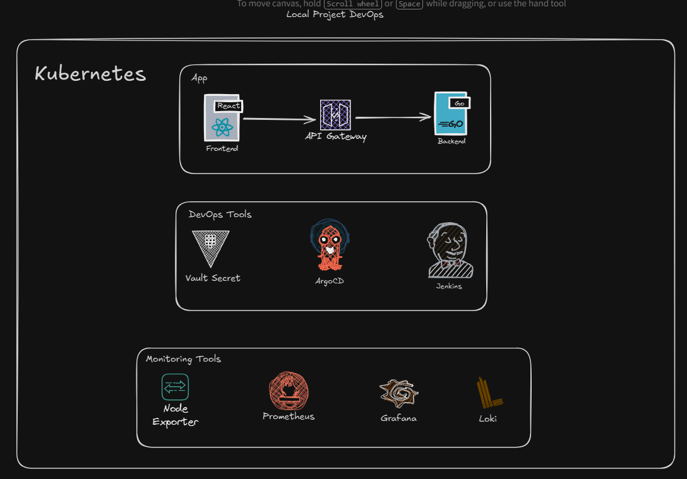

Temporary Porject :

1. Setup Jenkins casc 
- https://www.jenkins.io/doc/book/installing/kubernetes/
- https://dev.to/selmaguedidi/a-dive-into-jenkins-configuration-as-code-jcasc-4dj0
- https://medium.com/@tejasks/simplify-jenkins-configuration-management-with-cloudbees-casc-config-maps-e2cfbfc42435

Hot reload casc :
- running this command on script console UI:
import jenkins.model.*
import hudson.model.*

def user = User.get('admin', false)
def prop = user.getProperty(jenkins.security.ApiTokenProperty)
def token = prop.tokenStore.generateNewToken('casc-reload')
println(token.plainValue)

- running this command for hot reload casc :
curl -X POST \
  -u admin:<API_TOKEN> \
  --data '' \
  http://jenkins_url/configuration-as-code/reload

Jenkins :
- Setup Jenkins casc (Done)
- Setup Job DSL
- Setup Agent

Last Note
Job DSL belum di setup
